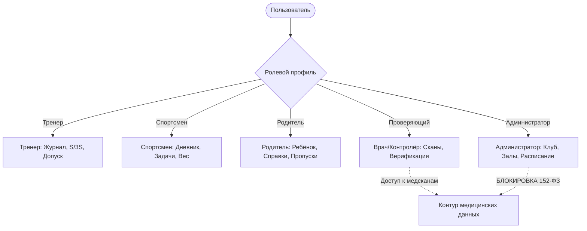

# Цифровой кабинет самбо (САМБО PRO)

Современная веб-платформа для комплексной цифровизации спортивных клубов и секций самбо. Система объединяет тренеров, юных спортсменов, родителей, спортивных врачей и администраторов в единое защищенное цифровое пространство.

---

## 📌 Оглавление
1. [Обзор системы и ключевые возможности](#-обзор-системы-и-ключевые-возможности)
2. [Архитектура и технологический стек](#-архитектура-и-технологический-стек)
3. [Ролевая модель и контур безопасности (152-ФЗ)](#-ролевая-модель-и-контур-безопасности-152-фз)
4. [Ключевые бизнес-алгоритмы](#-ключевые-бизнес-алгоритмы)
   - [«Правило 4 недель» (Посещаемость и рейтинг)](#правило-4-недель-расчет-эффективной-посещаемости-и-рейтинга)
   - [«Правило S/3S» (Освоение технических элементов)](#правило-s3s-верификация-освоения-навыков)
   - [Двухконтурный медицинский допуск и версионирование документов](#двухконтурный-медицинский-допуск-и-версионирование-документов)
5. [Отказоустойчивость и слой данных](#-отказоустойчивость-и-слой-данных)
6. [Инструкция по установке и запуску](#-инструкция-по-установке-и-запуску)
   - [Локальная разработка (Dev-режим)](#1-локальный-запуск-в-dev-режиме)
   - [Продакшен-сборка](#2-продакшен-сборка)
   - [Запуск через Docker и Docker Compose](#3-запуск-через-docker-compose)
7. [Структура проекта](#-структура-проекта)

---

## 🥋 Обзор системы и ключевые возможности

**«Цифровой кабинет самбо»** устраняет бумажную рутину спортивных секций, автоматизирует контрольно-переводные нормативы и гарантирует безопасность детей при допуске к спаррингам и соревнованиям:

- **Интерактивный журнал тренировок:** фиксация посещаемости в один клик, учет уважительных пропусков, индивидуальные замечания по схваткам.
- **Двухконтурный допуск к схваткам и турнирам:** строгое разграничение ролей при проверке справок (врач/контролер проверяет подлинность, тренер утверждает спортивное решение).
- **Матрица технических навыков самбо:** объективный контроль бросков, приемов в партере и самостраховки по методике трёхкратной верификации.
- **Личный кабинет юного спортсмена:** дневник весового контроля (этический стандарт без диет), индивидуальные видеоразборы и цели на соревнования.
- **Прозрачный кабинет родителя:** уведомления о статусе медицинских справок, подача заявлений на пропуск без потери спортивного рейтинга ребенка.
- **Панель администратора:** клубная сетка расписания залов, составы групп и управление контуром безопасности.

---

## 🛠 Архитектура и технологический стек

Система спроектирована как высокопроизводительное одностраничное веб-приложение (Single Page Application, SPA):

| Компонент / Слой | Технология | Описание / Назначение |
| :--- | :--- | :--- |
| **UI Framework** | React 18 (TypeScript) | Компонентная декларативная архитектура с строгой типизацией |
| **Стилизация** | Tailwind CSS 3 | Адаптивная дизайн-система, поддержка мобильных и десктопных экранов |
| **Иконки** | Lucide React | Единый векторный графический стиль интерфейса |
| **Сборщик** | Vite 6 | Сверхбыстрый HMR и оптимизированная сборка бандла с tree-shaking |
| **Стейт-менеджмент** | React Context (`AppContext`) | Реактивное состояние с защитой от повреждений и поддержкой оффлайн-работы |
| **Локальное хранилище** | LocalStorage API | Отказоустойчивый слой с защитой от переполнения квоты и приватного режима |
| **Контейнеризация** | Docker (Multi-stage) | Сборка в `node:22-alpine` и раздача статики через легковесный `nginx:alpine` |
| **Оркестрация** | Docker Compose | Запуск сервиса одной командой с пробросом портов и перезапуском |

---

## 🔒 Ролевая модель и контур безопасности (152-ФЗ)

Система реализует принцип наименьших привилегий (Principle of Least Privilege) и строгую ролевую модель:



### 1. Тренер (`coach`)
- Ведение журналов тренировок и плана занятия.
- Оценка технической подготовки по алгоритму S/3S.
- Постановка индивидуальных наблюдательных задач и рекомендаций.
- Принятие финального решения о допуске к тренировочным схваткам и турнирам на основании подтвержденного статуса документов.

### 2. Спортсмен (`athlete`)
- Просмотр расписания тренировок и соревнований.
- Доступ к индивидуальным домашним заданиям тренера.
- Фиксация контрольных взвешиваний (в нейтральном спортивном контексте).
- Просмотр персональных видеозаметок с анализом соревновательных ошибок.

### 3. Родитель (`parent`)
- Доступ строго изолирован данными собственного ребенка.
- Загрузка сканов справок от педиатра, страховых полисов и согласий.
- Подача уведомлений об уважительных пропусках (по болезни или семейным обстоятельствам).

### 4. Проверяющий / Врач (`verifier`)
- Единая очередь верификации входящих медицинских заключений и полисов.
- Проверка соответствия дат, печатей медучреждений и спортивных диспансеров.
- Вынесение вердикта: *«Проверено»*, *«Есть замечания»* с фиксацией комментария, даты и ФИО проверяющего.

### 5. Администратор (`admin`)
- Управление организационной структурой: группы, тренеры, залы, расписание занятий.
- **Изоляция медицинских данных (152-ФЗ «О персональных данных» и врачебная тайна):**
  - Администратор видит только организационные индикаторы (наличие допуска), но не имеет доступа к просмотру сканов медицинских справок и диагнозов.
  - Попытка доступа администратора к закрытым файлам блокируется системным предупреждением безопасности.

---

## 📐 Ключевые бизнес-алгоритмы

### «Правило 4 недель»: расчет эффективной посещаемости и рейтинга

Алгоритм предназначен для честного вычисления рейтинга дисциплины без демотивации спортсменов, пропустивших занятия по уважительной причине:

1. **Окно анализа:** последние 4 календарные недели тренировочных сессий.
2. **Эффективная база тренировок ($E$):**
   $$E = N_{\text{всего}} - N_{\text{уважительные}}$$
   Согласованные уважительные пропуски (справка от врача или заявление родителя) исключаются из знаменателя, предотвращая падение спортивного рейтинга.
3. **Процент посещаемости ($\text{Rate}$):**
   $$\text{Rate} = \begin{cases} \left\lfloor\frac{N_{\text{присутствовал}}}{E} \times 100\%\right\rceil, & E > 0 \\ 0\%, & E = 0 \end{cases}$$
4. **Условия допуска к рейтингу:**
   - Если $E < 4$, спортсмен получает статус **«Без места (E < 4)»** (недостаточно сессий для объективной выборки).
   - Если в журнале есть хотя бы одно неотмеченное занятие (`unmarked`), присвоение места **блокируется** до завершения тренерского учета.
   - Места распределяются по стандартной соревновательной системе ранжирования (при одинаковом проценте спортсмены делят место: 1, 1, 3...).

---

### «Правило S/3S»: верификация освоения навыков

Для объективной аттестации технических приемов самбо (броски через бедро, подсечки, удержания, рычаг локтя) применяется критерий стабильности:

- **Требование:** прием должен быть успешно продемонстрирован в **3 независимых тренировочных сессиях** ($S_1, S_2, S_3$).
- **Статусы правила:**
  - $\text{Зачёт 3/3} \rightarrow$ **«Освоено»** (прием закреплен в двигательном навыке).
  - Наличие незаполненных проверок (`null`) $\rightarrow$ **«В процессе»**.
  - При 3 проведенных проверках с результатами менее 3 успехов $\rightarrow$ **«Требуется доработка»**.

---

### Двухконтурный медицинский допуск и версионирование документов

- При загрузке новой копии документа автоматически создается инкрементная версия ($v_{n+1}$).
- Статус проверки нового документа мгновенно сбрасывается в `unverified` («На проверке»).
- Сроки действия рассчитываются относительно текущей контрольной даты:
  - $\le 14$ дней до окончания $\rightarrow$ статус `expiring_soon` (предупреждающий желтый индикатор).
  - Срок истек $\rightarrow$ статус `expired` (блокирующий красный индикатор).
  - Спортивное решение о допуске спортсмена к поединкам утверждается тренером строго на основании действующего положительного пакета.

---

## 🛡 Отказоустойчивость и слой данных

В приложении реализована многоуровневая защита целостности данных (`src/context/AppContext.tsx`):

1. **Защита LocalStorage:**
   - Безопасная проверка доступности хранилища (предотвращает краш в Safari Private Browsing и изолированных iFrame).
   - Обработка исключения `QuotaExceededError`: уведомление пользователя о заполнении памяти без падения приложения.
   - Перехват синтаксических ошибок JSON при повреждении локальных записей.
2. **Автоматический Fallback:**
   - Валидация всех ключевых полей структуры состояния. При повреждении или неполноте данных происходит безопасное слияние с исходным `seedData`.
3. **Защита мутаций от null/undefined:**
   - Все методы мутации (`updateAttendance`, `reportAbsence`, `addAthlete`, `uploadDocument`, `updateAdmissionDecision` и др.) содержат строгие проверки входных аргументов и безопасные развертки вложенных объектов и массивов.
4. **Резервное копирование и экспорт/импорт (JSON):**
   - Возможность скачать полный снимок базы данных клуба в JSON-файл в один клик.
   - Возможность импортировать ранее сохраненную резервную копию с валидацией структуры данных.

---

## 🚀 Инструкция по установке и запуску

### Предварительные требования
- **Node.js**: версия 18.0.0 или новее
- **npm**: версия 9.0.0 или новее
- *(Опционально)* **Docker** и **Docker Compose**

---

### 1. Локальный запуск в dev-режиме

```bash
# 1. Клонировать репозиторий или перейти в каталог проекта:
cd sambo-digital-cabinet

# 2. Установить зависимости:
npm install

# 3. Запустить сервер разработки Vite:
npm run dev
```

После запуска приложение будет доступно по адресу:
👉 `http://localhost:5173`

---

### 2. Продакшен-сборка

```bash
# Проверка типов TypeScript и сборка оптимизированного бандла:
npm run build

# Предпросмотр собранного бандла:
npm run preview
```

Скомпилированные статические файлы сохраняются в директорию `dist/`.

---

### 3. Запуск через Docker Compose

Для промышленного развертывания используется мультистейдж-сборка с минимальным весом образа и веб-сервером Nginx:

```bash
# Сборка и запуск контейнера в фоновом режиме:
docker compose up -d --build
```

Проверить статус контейнера:
```bash
docker compose ps
```

Приложение доступно по адресу:
👉 `http://localhost:3000`

Остановка контейнера:
```bash
docker compose down
```

#### Запуск через стандартный Docker (без compose):
```bash
# Сборка образа
docker build -t sambo-digital-cabinet .

# Запуск контейнера
docker run -d --name sambo-cabinet -p 3000:80 sambo-digital-cabinet
```

---

## 📂 Структура проекта

```text
sambo-digital-cabinet/
├── .github/                     # Конфигурации CI/CD
├── dist/                        # Продакшен-сборка (генерируется при npm run build)
├── node_modules/                # Зависимости проекта
├── public/                      # Публичные статические ресурсы
├── src/
│   ├── components/              # Переиспользуемые компоненты интерфейса
│   │   ├── modals/              # Модальные окна с валидацией пользовательского ввода
│   │   │   ├── AddAthleteModal.tsx         # Добавление спортсмена (валидация ФИО, даты рождения, телефонов)
│   │   │   ├── EditAthleteModal.tsx        # Редактирование профиля
│   │   │   ├── AddWeightModal.tsx          # Внесение веса (валидация 15–200 кг, даты)
│   │   │   ├── AddCompetitionModal.tsx     # Турниры (валидация диапазона дат start <= end)
│   │   │   ├── ReportAbsenceModal.tsx      # Уважительный пропуск (валидация причин и комментариев)
│   │   │   ├── UploadDocumentModal.tsx     # Загрузка документов (валидация срока действия)
│   │   │   ├── AdmissionDecisionModal.tsx  # Принятие решения о допуске
│   │   │   ├── DocumentViewModal.tsx       # Просмотр документа
│   │   │   ├── EditGroupModal.tsx          # Настройка группы
│   │   │   ├── EditScheduleSlotModal.tsx   # Редактирование расписания
│   │   │   └── ObservationTaskModal.tsx    # Задачи индивидуального наблюдения
│   │   ├── DevHeader.tsx        # Переключатель ролей и сброс демонстрационных данных
│   │   └── Sidebar.tsx          # Главная навигационная панель
│   ├── context/
│   │   └── AppContext.tsx       # Отказоустойчивый стейт, LocalStorage, экспорт/импорт JSON
│   ├── data/
│   │   └── seedData.ts          # Демонстрационный набор данных самбо-клуба
│   ├── types/
│   │   └── index.ts             # TypeScript-интерфейсы сущностей (Athlete, Session, DocRecord и др.)
│   ├── utils/
│   │   └── rules.ts             # Реализация правил: 4 недель, S/3S, проверка срока справок
│   ├── views/                   # Ролевые экраны
│   │   ├── coach/               # Разделы тренера (Сегодня, Группа, Аттестация, Отчеты, Турниры)
│   │   ├── athlete/             # Разделы спортсмена (Дневник, Задания, Схватки)
│   │   ├── parent/              # Разделы родителя (Документы ребенка, Уведомления о пропуске)
│   │   ├── verifier/            # Раздел врача/проверяющего (Очередь верификации справок)
│   │   └── admin/               # Раздел администратора (Клуб, Залы, Расписание, Резервное копирование)
│   ├── App.tsx                  # Корневой компонент и ролевой роутинг
│   ├── index.css                # Tailwind CSS директивы и глобальные стили
│   └── main.tsx                 # Точка входа React
├── .dockerignore                # Исключения Docker
├── .gitignore                   # Исключения Git
├── docker-compose.yml           # Конфигурация сервисов Docker Compose
├── Dockerfile                   # Мультистейдж сборка (Node.js -> Nginx)
├── index.html                   # HTML-шаблон
├── nginx.conf                   # Конфигурация Nginx для SPA-роутинга
├── package.json                 # Зависимости и npm-скрипты
├── tsconfig.json                # Конфигурация компилятора TypeScript
└── vite.config.ts               # Конфигурация сборщика Vite
```

---

## 📄 Лицензия и соответствие стандартам

- Проект разработан в соответствии с методическими рекомендациями Всероссийской федерации самбо.
- Разграничение доступа к медицинским картам соответствует положениям Федерального закона № 152-ФЗ «О персональных данных» и нормам врачебной тайны.
